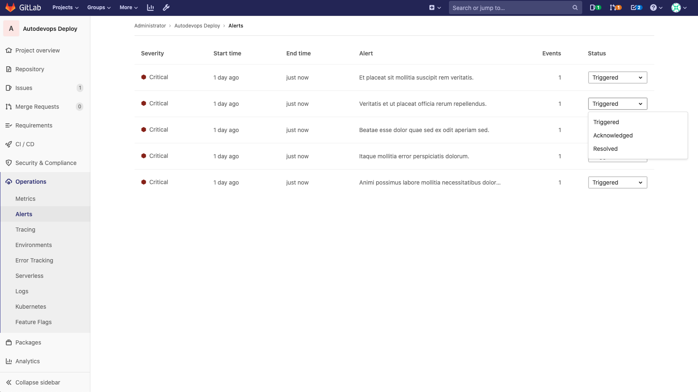

# Alert Management

> [Introduced](https://gitlab.com/groups/gitlab-org/-/epics/2877) in GitLab 13.0.

Alert Management enables developers to easily discover and view the alerts
generated by their application. By surfacing alert information where the code is
being developed, efficiency and awareness can be increased.

### Enabling Alert Management

NOTE: **Note:**
You will need at least Maintainer [permissions](../../permissions.md) to enable the Alert Management feature.

### Alert Management Severity

For alerts, we offer a easy way for a user to identify the severity of a particular alert via a set of icons which are shaped and color coded appropriately. These severity icons can act as instant feedback for which Alerts need to be made a priority for investigation.

Icon Naming: `severity`

Alert icons:

| Name         | Icon                                                           | Color(hex) |
| ------------ | -------------------------------------------------------------- | ---------- |
| `Critical`   | https://gitlab-org.gitlab.io/gitlab-svgs/?q=severity-critical  | #8b261     |
| `High`       | https://gitlab-org.gitlab.io/gitlab-svgs/?q=severity-high      | #c0341d    |
| `Medium`     | https://gitlab-org.gitlab.io/gitlab-svgs/?q=severity-medium    | #fca429    |
| `Low`        | https://gitlab-org.gitlab.io/gitlab-svgs/?q=severity-low       | #fdbc60    |
| `Info`       | https://gitlab-org.gitlab.io/gitlab-svgs/?q=severity-info      | #418cd8    |
| `Unknown`    | https://gitlab-org.gitlab.io/gitlab-svgs/?q=severity-unknown   | #bababa    |

### Alert Management List

NOTE: **Note:**
You will need at least Developer [permissions](../../permissions.md) to view the Alert Management list.

You can find the Alert Management list at **Operations > Alerts** in your project's sidebar.
Each alert has a set of meaningful metric which include:

- `serverity`
    - An alerts severity
- `start time`
    - An alerts start time
- `end time`
    - An alerts start time
- `alert description`
    - An alerts description
- `event count`
    - The number of times that an alert has fired
- `status`
    - The alerts current status

Each alert contains a status dropdown which is important because it communicates which alerts need to be investigated. Standard alert statuses include `triggered`, `acknowledged`, and `resolved`.

Alert Statuses:

| Name           | Meaning                                                       |
| -------------- | ------------------------------------------------------------- |
| `Triggered`    | Indicates that no one has begun investigation.                |
| `Acknowledged` | Indicates that someone is actively investigating the problem. |
| `Resolved`     | Indicates no further work is required.                        |

