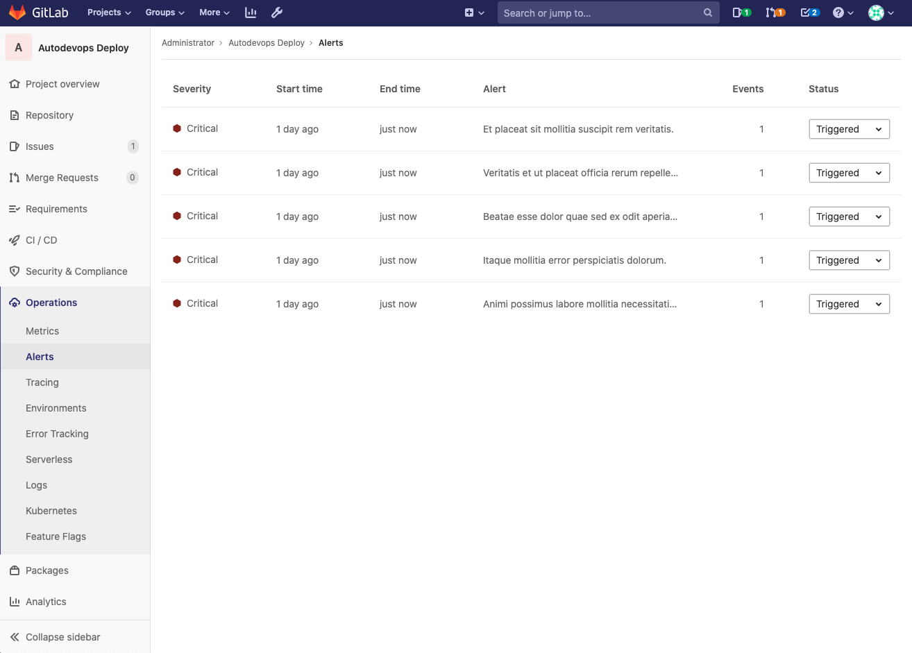

# Alert Management

> [Introduced](https://gitlab.com/groups/gitlab-org/-/epics/2877) in GitLab 13.0.

Alert Management enables developers to easily discover and view the alerts
generated by their application. By surfacing alert information where the code is
being developed, efficiency and awareness can be increased.

## Enabling Alert Management

NOTE: **Note:**
You will need at least Maintainer [permissions](../../permissions.md) to enable the Alert Management feature.

## Alert Management severity

Each level of alert contains a uniquely shaped and color-coded icon to help
you identify the severity of a particular alert. These severity icons help you
immediately identify which alerts you should prioritize investigating:

Alerts contain one of the following icons:

- **Critical**: **{severity-critical}** and hexadecimal color `#8b261`
- **High**: **{severity-high}** and hexadecimal color `#c0341d`
- **Medium**: **{severity-medium}** and hexadecimal color `#fca429`
- **Low**: **{severity-low}** and hexadecimal color `#fdbc60`
- **Info**: **{severity-info}** and hexadecimal color `#418cd8`
- **Unknown**: **{severity-unknown}** and hexadecimal color `#bababa`

## Alert Management List

NOTE: **Note:**
You will need at least Developer [permissions](../../permissions.md) to view the Alert Management list.

You can find the Alert Management list at **Operations > Alerts** in your project's sidebar.
Each alert has a set of meaningful metric which include:

- `serverity`
- `start time`
- `end time`
- `alert description`
- `event count`
- `status`

