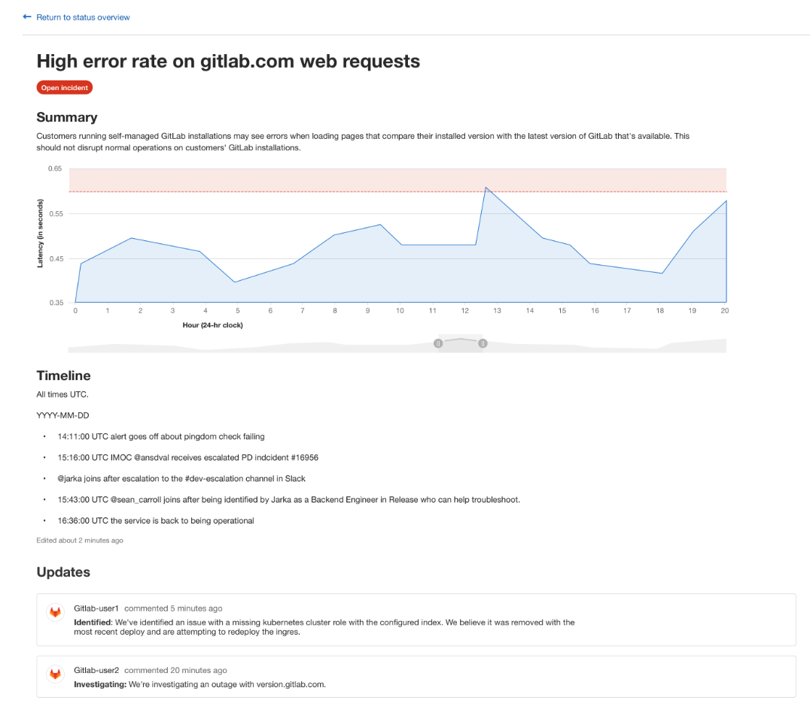

# GitLab Status Page

> [Introduced](https://gitlab.com/groups/gitlab-org/-/epics/2479) in GitLab 12.9.

GitLab Status Page allows you to create and deploy a static website to communicate efficiently to users during an incident.

## How to set-up

To use GitLab Status Page you first need to set up your account details for your cloud provider in the operations settings page.

NOTE: **Note:**
At this time only AWS S3 is supported as a deploy target.

1. Navigate to **Settings > Operations > Status Page**
1. Fill in your cloud provider's credentials and make sure the **Active** checkbox is checked.
1. Submit the form and to save your details.

### Incident detail page

The incident detail page shows detailed information about a particular incident, including:

- Status on the incident including when the incident was last updated
- Incident title
- The description of the incident
- A chronological ordered list of updates to the incident

## How it works

### Publishing Incidents

To publish an Incident, you first need to create an Issue in the Project you enabled the Status Page settings in.

Once this Issue is created, a background worker will publish the issue onto the status page using the credentials you provided during set-up.

### Publishing updates

To publish an update to the Incident, simply update the incident Issue's description.

### Adding comments

To add comments to the Status Page Incident, you simply create a comment on the incident Issue.

When you're ready to publish the comment, add a microphone emoji reaction (`:microphone` 🎤) [award emoji](../../../user/award_emojis.md) to the comment. This marks the comment as one which should be deployed to the Status Page.

CAUTION: **Caution:**
Anyone with access to view the Issue can add an Emoji Award to a comment, so you may want to keep your Issues limited to team members only.

### Changing the Incident status

To change the incident status from `open` to `closed`, you can simply close the incident Issue within GitLab. This will then be updated shortly on the Status page website.
